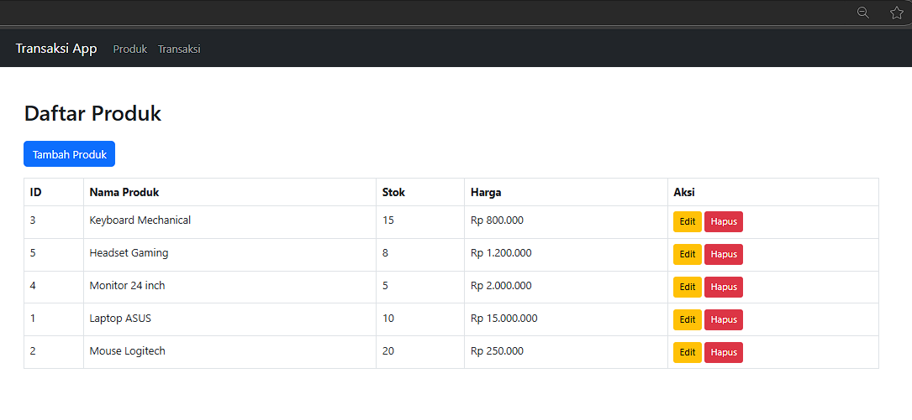
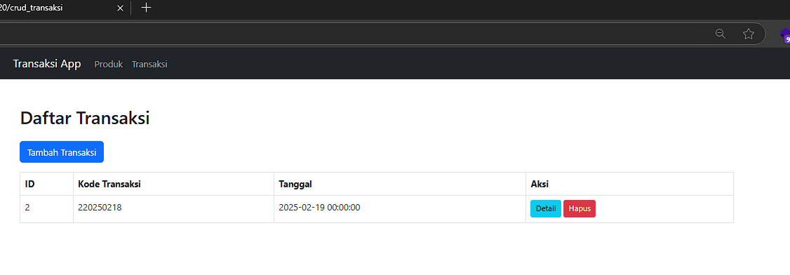
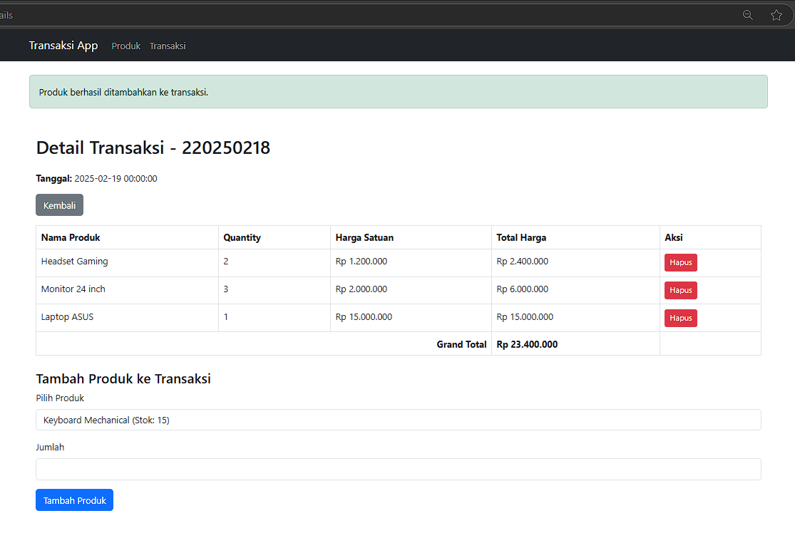

# Laravel 11 - Aplikasi Transaksi Sederhana

## 📌 Fitur
- CRUD Produk, Transaksi, dan Detail Transaksi
- Validasi stok saat checkout
- Stok otomatis berkurang saat transaksi dibuat
- Stok dikembalikan saat transaksi dihapus
- Grand Total di detail transaksi
- Tampilan responsif dengan Bootstrap 5

## 🚀 Instalasi
```sh
# Clone repository
git clone https://github.com/upi20/crud_transaksi.git
cd crud_transaksi

# Install dependencies
composer install

# Buat file .env
cp .env.example .env

# Generate key & konfigurasi database
php artisan key:generate

# Migrate & seeder database
php artisan migrate --seed

# Jalankan aplikasi
php artisan serve
```

Akses aplikasi di: `http://127.0.0.1:8000`

## Preview
### Daftar Produk


### Daftar Transaksi


### Detail Transaksi
